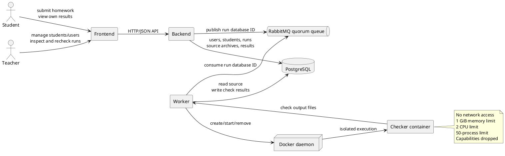

# BME Basics of Programming 1 homework checker

This project is a homework checking framework for the BME Basics of Programming 1 subject. Students submit C/C++ homework archives, and teachers can inspect the resulting checks through the web application.

The system accepts a ZIP archive, validates it, stores it in PostgreSQL, and queues a check request. A worker consumes the request and starts an isolated checker container. The checker runs the configured checks and the worker stores the results and generated attachments back in PostgreSQL.

## Architecture

The major components are:

- **Frontend**: React and Vite web application for student and teacher workflows.
- **Backend**: Go, Gin, and GORM HTTP API. It handles authentication, submissions, users, students, run management, and result retrieval.
- **PostgreSQL**: Persistent storage for users, students, homework runs, source ZIP archives, check results, and attachments.
- **RabbitMQ**: Durable quorum queue used to transfer run database IDs from the backend to the worker.
- **Worker**: Go background service that consumes RabbitMQ messages and starts checker containers.
- **Checker**: A container based on the CG3 image from the [bodand/cg3 project](https://github.com/bodand/cg3). It compiles and analyzes submissions and writes structured check output.
- **Docker daemon**: The worker uses the Docker API to create and remove checker containers.

### Component diagram



### Submission flow

1. A student or teacher submits a base64-encoded ZIP archive through the backend API.
2. The backend decodes and validates the archive. The decoded source is limited to 1 MiB and protected against ZIP bombs.
3. The backend creates a run in PostgreSQL and publishes its numeric database ID to RabbitMQ.
4. The worker consumes the ID and reads the source archive from PostgreSQL.
5. The worker creates a temporary checker container through Docker and copies the archive into it as `/cg3/input.zip`.
6. The checker extracts and analyzes the submission, writing results under `/cg3/out`.
7. The worker reads the checker output, stores check results and attachments in PostgreSQL, and marks the run as complete.
8. The frontend retrieves the run status and results through the backend API.

## Repository Layout

- `backend/`: HTTP API, database models, authentication, and RabbitMQ client.
- `worker/`: RabbitMQ consumer and Docker-based checker runner.
- `checker/`: Checker script, call-graph helper, and reference `debugmalloc.h`.
- `frontend/`: React/Vite frontend.
- `Dockerfile-backend`: Backend container image.
- `Dockerfile-worker`: Worker container image.
- `Dockerfile-checker`: Checker image.
- `build.sh`: Builds all three project images.
- `compose.yml`: Local multi-container deployment.
- `.env.example`: Example configuration for the backend, worker, PostgreSQL, and RabbitMQ.

## Building

The repository includes `build.sh`, which builds the backend, worker, and checker images:

```bash
./build.sh
```

The script creates these local images:

```text
kisbogdan/cg3-backend:latest
kisbogdan/cg3-worker:latest
kisbogdan/cg3-checker:latest
```

The backend image is built from `Dockerfile-backend`. It compiles the Go backend into an Alpine-based runtime image and exposes port `8080`.

The worker image is built from `Dockerfile-worker`. It compiles the worker into an Alpine-based runtime image.

The checker image is built from `Dockerfile-checker`. It starts from the CG3 image, installs the compiler and analysis dependencies, copies the checker tools, and uses `/cg3/cg.sh` as its entrypoint.

### Frontend build

The frontend can be built independently:

```bash
cd frontend
npm install
npm run build
```

The current backend Dockerfile contains the frontend build and copy stages as commented-out instructions. Therefore, the `build.sh` backend image does not currently include the frontend `dist` directory. The backend serves frontend files only when they are available in its configured `FRONTEND_DIR`.

For frontend development, run:

```bash
cd frontend
npm run dev
```

## Local deployment

Create the runtime environment file from the example and review its values:

```bash
cp .env.example .env
```

Build the images and start the services:

```bash
./build.sh
docker compose up -d
```

The Compose deployment starts:

- `backend`: HTTP API on `http://localhost:8080`.
- `worker`: background queue consumer with access to `/var/run/docker.sock`.
- `postgres`: persistent database stored in `./db-data`.
- `rabbitmq`: queue broker; the management interface is exposed on `http://localhost:15672`.

PostgreSQL and RabbitMQ health checks are used before the backend and worker start. All application services use `.env` through Compose's `env_file` configuration.

To view service logs:

```bash
docker compose logs -f backend worker
```

To stop the deployment:

```bash
docker compose down
```

The PostgreSQL data remains in `./db-data` after the services are stopped.

### Worker and checker requirements

The worker must be able to access a Docker daemon. Compose provides this through:

```yaml
volumes:
    - /var/run/docker.sock:/var/run/docker.sock
```

This gives the worker control over the host Docker daemon. The checker image must be available to that same daemon. The image name defaults to `kisbogdan/cg3-checker` and can be changed with `CG3_DOCKER_IMAGE`.

Each checker container is temporary and runs with no network access, a 1 GiB memory limit, two CPUs, a 50-process limit, and all Linux capabilities dropped.

## Configuration

`.env.example` contains the variables used by the current Compose deployment. Important settings include:

| Variable                                                                             | Purpose                                                              |
| ------------------------------------------------------------------------------------ | -------------------------------------------------------------------- |
| `DB_HOST`, `DB_PORT`, `DB_USER`, `DB_PASS`, `DB_NAME`                                | Backend and worker PostgreSQL connection.                            |
| `POSTGRES_USER`, `POSTGRES_PASSWORD`, `POSTGRES_DB`                                  | PostgreSQL container initialization.                                 |
| `RABBITMQ_HOST`, `RABBITMQ_PORT`, `RABBITMQ_USER`, `RABBITMQ_PASS`, `RABBITMQ_QUEUE` | Backend and worker RabbitMQ connection.                              |
| `JWT_SECRET`, `JWT_EXPIRATION`                                                       | JWT signing and expiration.                                          |
| `SERVER_ADDRESS`                                                                     | Backend HTTP listen address.                                         |
| `CG3_DOCKER_IMAGE`                                                                   | Checker image launched by the worker.                                |
| `PROD`                                                                               | Makes missing environment variables fatal when set to `true` or `1`. |

The backend runs database migrations at startup. The worker connects to the same database without running migrations.

## API documentation

The backend API is documented in [backend/README.md](backend/README.md). It includes authentication, teacher and student endpoints, request and response formats, result-field nullability, ZIP validation, and error responses.

The worker and checker runtime behavior is documented in [worker/README.md](worker/README.md).
